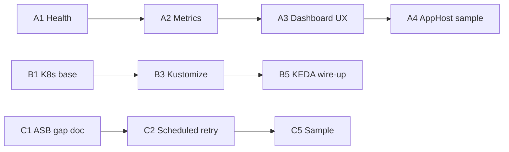

# Execution Plan: Phase 5 Remaining (Post-Autoscaling)

**Status:** DRAFT — planning PR only (no runtime changes)  
**Branch:** `cursor/execution-plan-next-slice`  
**Last updated:** 2026-05-20  
**Owner:** maintainer  

This plan turns the open Phase 5 items in `ROADMAP.md` into issue-ready tasks after the autoscaling helpers slice (PR #10).

---

## Shipped baseline (do not re-implement)

| Deliverable | Location |
| --- | --- |
| DLQ metric tags + taxonomy | `MessagingMetrics.BuildDeadLetterTags` |
| DLQ dashboard + alerts | `docs/observability/dlq-dashboard.md` |
| Autoscaling signals + thresholds | `docs/observability/autoscaling-signals.md` |
| KEDA / HPA reference manifests | `docs/deploy/kubernetes/` |
| Kafka partition dispatch + CI broker tests | `Syed.Messaging.Kafka`, workflow |

---

## Strategic themes (next 6–8 weeks)

| Theme | Outcome | Primary packages / paths |
| --- | --- | --- |
| **T1 — Aspire ops surface** | Local dev shows messaging health, metrics, and DLQ pressure in Aspire dashboard | `Syed.Messaging.Aspire`, sample AppHost |
| **T2 — Kubernetes production recipes** | Copy-paste deploy path beyond autoscaling references | `docs/deploy/kubernetes/`, Helm/Kustomize starters |
| **T3 — Azure Service Bus hardening** | Parity with Rabbit/Kafka retry + scheduling story | `Syed.Messaging.AzureServiceBus`, `samples/ServiceBusWorker` |

---

## Biweekly lanes

### Lane A (weeks 1–2): Aspire component expansion

| ID | Task | Size | Depends on |
| --- | --- | --- | --- |
| A1 | Add Aspire health check resource for messaging transports | M | — |
| A2 | Expose `Syed.Messaging` meter to Aspire OpenTelemetry defaults in extension | S | A1 |
| A3 | Add dashboard annotations / resource commands (DLQ peek link, metrics URI) | M | A2 |
| A4 | Sample: `samples/AspireAppHost` with RabbitMQ + worker + dashboard | L | A1–A3 |
| A5 | Document Aspire setup in README + `docs/observability/` cross-links | S | A4 |

**Lane A Definition of Done**

- AppHost starts worker + broker; Aspire dashboard shows messaging health and at least one metrics panel path.
- README section: “Run with Aspire” with 3 commands or fewer.

---

### Lane B (weeks 3–4): Kubernetes deployment recipes

| ID | Task | Size | Depends on |
| --- | --- | --- | --- |
| B1 | Base Deployment + Service + ServiceMonitor for worker metrics | M | — |
| B2 | ConfigMap/Secret pattern for connection strings and OTel exporter | S | B1 |
| B3 | Kustomize overlay: `dev` / `staging` / `prod` | M | B1, B2 |
| B4 | Helm chart stub (optional) or document why Kustomize-only | S | B3 |
| B5 | Wire KEDA `ScaledObject` into overlay (from existing reference) | S | B3, autoscaling doc |
| B6 | Runbook: deploy, rollback, scale test, alert hooks | M | B5 |

**Lane B Definition of Done**

- New operator can deploy a worker to K8s using docs only (no tribal knowledge).
- Prometheus scrapes `messaging_*` metrics; KEDA ScaledObject applies with documented thresholds.

---

### Lane C (weeks 5–6): Azure Service Bus hardening

| ID | Task | Size | Depends on |
| --- | --- | --- | --- |
| C1 | Document current ASB retry/scheduling gaps vs Rabbit/Kafka | S | — |
| C2 | Implement scheduled deferred retry (align with roadmap) | L | C1 |
| C3 | Config surface: backoff, max delivery, session options | M | C2 |
| C4 | DLQ metric tag parity audit for ASB transport | S | — |
| C5 | Expand `samples/ServiceBusWorker` + README | M | C2–C4 |
| C6 | Integration test or documented manual test matrix | M | C5 |

**Lane C Definition of Done**

- `ROADMAP.md` Azure Service Bus row moves from ⚠️ Minimal to ✅ Stable (or explicit partial with ADR).
- Sample demonstrates scheduled retry and DLQ metrics visible in Prometheus.

---

## Issue-ready backlog (create on GitHub)

Copy each block into a GitHub Issue. Suggested labels: `theme:observability`, `theme:dx`, `theme:transport`, `type:feature`, `type:docs`, `type:test`, `size:S|M|L`.

### P0 — Start immediately (Lane A)

1. **Aspire: messaging health check resource** (`A1`, M)  
   - **Acceptance:** `AddSyedMessagingHealthChecks()` (or equivalent) registers transport connectivity; fails when broker unreachable.  
   - **Test:** unit or integration test against Testcontainers RabbitMQ.

2. **Aspire: OpenTelemetry meter wiring** (`A2`, S)  
   - **Acceptance:** `AddSyedMessagingInstrumentation()` includes `Syed.Messaging` meter in Aspire-default metrics pipeline.  
   - **Test:** sample emits `messaging_messages_processed_total` visible in local scrape.

3. **Aspire: AppHost sample** (`A4`, L)  
   - **Acceptance:** `samples/AspireAppHost` runs worker + RabbitMQ resource; README with `dotnet run` steps.  
   - **Test:** CI builds sample (smoke `dotnet build` minimum).

### P1 — After Lane A merge (Lane B)

4. **K8s: base worker manifest + ServiceMonitor** (`B1`, M)  
5. **K8s: Kustomize overlays** (`B3`, M)  
6. **K8s: deployment runbook** (`B6`, M)  

### P2 — Transport parity (Lane C)

7. **ASB: scheduled deferred retry** (`C2`, L)  
8. **ASB: sample + docs parity** (`C5`, M)  

### P3 — DX / release hygiene

9. **Define v1.0 release gate** (from quarter plan, S) — `docs/release-criteria.md`  
10. **ROADMAP ↔ README status reconciliation** (S)  

---

## Dependencies and sequencing

**Parallel OK:** Lane B (docs/manifests) can start in week 2 while A4 is in review. Lane C should not block A or B.

---

## Risks and mitigations

| Risk | Trigger | Mitigation |
| --- | --- | --- |
| Aspire API churn | Dashboard APIs change between Aspire versions | Pin sample to documented Aspire version; smoke build in CI |
| K8s manifest drift | Cluster-specific Prometheus/KEDA installs | Keep manifests minimal; document required operators in README |
| ASB scheduling complexity | Azure SDK behavior differs from Rabbit delay queues | ADR for retry model; staged rollout behind options flag |
| Solo-maintainer overload | 3 lanes active at once | One lane “active”; others in backlog until DoD met |

---

## Success metrics (end of plan horizon)

| Metric | Target |
| --- | --- |
| Aspire sample runnable from clean clone | ≤ 5 minutes to dashboard |
| K8s deploy doc completeness | Operator checklist 100% pass on staging |
| ASB sample parity | Retry + DLQ + metrics demonstrated |
| Open GitHub issues from this plan | ≥ 8 created, ≥ 4 closed |

---

## Weekly ritual (15 min)

1. Pick **one active lane** (A, B, or C).  
2. Move at most **2 issues** to In Progress.  
3. Update `ROADMAP.md` “Next Concrete Issue” when a lane completes.  
4. Close or defer anything slipped with a one-line reason in the issue.

---

## Related documents

- [ROADMAP.md](../ROADMAP.md)
- [office-hours-quarter-plan.md](./office-hours-quarter-plan.md)
- [autoscaling-signals.md](./observability/autoscaling-signals.md)
- [dlq-dashboard.md](./observability/dlq-dashboard.md)
- Existing Aspire package: `src/Syed.Messaging.Aspire/AspireMessagingExtensions.cs` (RabbitMQ connection helper only today)
