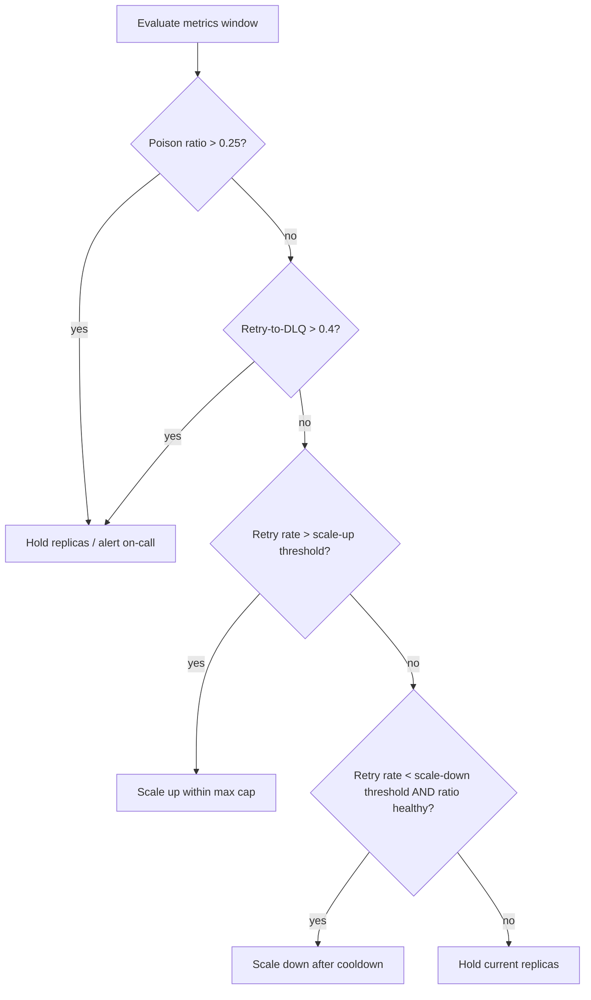

# Message Throughput Autoscaling Signals

This guide turns Syed.Messaging retry and DLQ metrics into Kubernetes autoscaling decisions.
It complements the dashboard and alert definitions in [dlq-dashboard.md](./dlq-dashboard.md).

## Prerequisites

1. Export the `Syed.Messaging` meter to Prometheus (see `samples/KafkaWorker/README.md`).
2. Confirm metric names in your scrape target. OpenTelemetry instruments use dotted names; Prometheus exporters typically emit:

| Instrument | Typical Prometheus name |
| --- | --- |
| `messaging.messages.retried` | `messaging_messages_retried_total` |
| `messaging.messages.deadlettered` | `messaging_messages_deadlettered_total` |
| `messaging.messages.poisoned` | `messaging_messages_poisoned_total` |
| `messaging.messages.processed` | `messaging_messages_processed_total` |
| `messaging.messages.processing_duration` | `messaging_messages_processing_duration_*` |

3. Install cluster components (pick one scaling path):

| Path | Components |
| --- | --- |
| KEDA (recommended) | [KEDA](https://keda.sh/) + Prometheus reachable from the cluster |
| HPA + custom metrics | `metrics-server` + [prometheus-adapter](https://github.com/kubernetes-sigs/prometheus-adapter) |

Reference manifests: `docs/deploy/kubernetes/`.

---

## Signal model

Use four signals. Scale on **pressure** (retries + backlog), not on DLQ alone — DLQ often means "stop scaling and fix the bug."

### 1. Retry pressure (scale-up primary)

Retries indicate transient failures or overload. Rising retry rate is the main scale-up signal.

```promql
sum(rate(messaging_messages_retried_total[5m]))
```

**Scale up when:** retry rate exceeds your baseline for two consecutive evaluation windows (see threshold table).

### 2. Throughput headroom (scale-up secondary)

Healthy throughput with elevated processing latency suggests CPU-bound handlers.

```promql
histogram_quantile(
  0.95,
  sum(rate(messaging_messages_processing_duration_bucket[5m])) by (le)
)
```

**Scale up when:** p95 processing duration exceeds SLO (example: > 2000 ms) **and** retry pressure is not already critical.

### 3. Retry-to-DLQ conversion (scale-down guard / scale-up block)

High conversion means scaling adds load to a broken pipeline.

```promql
sum(increase(messaging_messages_deadlettered_total[15m]))
/
clamp_min(sum(increase(messaging_messages_retried_total[15m])), 1)
```

**Block scale-up when:** ratio > 0.4 for 15m (aligns with [dlq-dashboard.md](./dlq-dashboard.md) alert).

**Scale down only when:** ratio is normal **and** retry pressure is below scale-down threshold.

### 4. Poison ratio (incident guard)

Poison messages are schema or contract failures. Autoscaling will not fix them.

```promql
sum(increase(messaging_messages_poisoned_total[15m]))
/
clamp_min(sum(increase(messaging_messages_deadlettered_total[15m])), 1)
```

**Block all scale-up when:** ratio > 0.25 for 15m. Page on-call and fix producer/schema compatibility first.

---

## Composite pressure score (optional)

For a single KEDA trigger or HPA external metric, combine retry rate and DLQ rate with DLQ weighted higher (DLQ is worse than retry):

```promql
(
  10 * sum(rate(messaging_messages_deadlettered_total[5m]))
  + sum(rate(messaging_messages_retried_total[5m]))
)
```

Tune the `10` multiplier per workload. Start conservative; increase if DLQ spikes lag behind retry spikes.

---

## Threshold table (starting defaults)

Calibrate using 7–14 days of production baseline. Replace `BASELINE_RETRY_RPS` with your observed p50 retry rate during normal load.

| Signal | Warning | Scale-up trigger | Scale-down trigger | Notes |
| --- | --- | --- | --- | --- |
| Retry rate (5m) | > 2× baseline | > 3× baseline for 10m | < 0.5× baseline for 30m | Primary scale driver |
| DLQ rate (5m) | > 1 msg/s | — (do not scale up) | — | Investigate; see runbook |
| Retry→DLQ ratio (15m) | > 0.25 | > 0.4 blocks scale-up | < 0.1 required for scale-down | Recovery quality gate |
| Poison ratio (15m) | > 0.15 | > 0.25 blocks scale-up | — | Schema/producer issue |
| Processing p95 (5m) | > SLO | > SLO + retry pressure elevated | < 0.5× SLO for 30m | Secondary; avoid alone |

### Cooldown and replica bounds

| Parameter | Recommended start | Rationale |
| --- | --- | --- |
| `minReplicaCount` | 1–2 | Keep at least one consumer alive |
| `maxReplicaCount` | partition count (Kafka) or queue consumer limit | Avoid exceeding broker ordering/partition capacity |
| Scale-up cooldown | 120–300s | Let new pods warm up before next scale |
| Scale-down cooldown | 300–600s | Prevent flapping on bursty traffic |
| KEDA `pollingInterval` | 30s | Balance responsiveness vs API load |
| Evaluation window | 2× polling interval | Require sustained signal, not single spike |

### Kafka-specific cap

For partition-ordered topics, **effective parallelism is bounded by partition count**. Set:

```text
maxReplicaCount = min(desired_max, topic_partition_count)
```

Extra replicas above partition count do not increase throughput for a single consumer group on one topic.

---

## Decision flow



---

## Worked example (baseline calculator)

Assume measured baselines from Prometheus over 7 days:

| Metric | Baseline (normal) |
| --- | --- |
| Retry rate (5m avg) | 0.8 msg/s |
| DLQ rate (5m avg) | 0.02 msg/s |
| Retry→DLQ ratio (15m) | 0.05 |
| Processing p95 | 450 ms |

Derived thresholds:

| Action | Threshold |
| --- | --- |
| Scale-up retry trigger | > 2.4 msg/s (3× 0.8) for 10m |
| Scale-down retry trigger | < 0.4 msg/s (0.5× 0.8) for 30m |
| Block scale-up (DLQ conversion) | ratio > 0.4 for 15m |
| Composite score alert | > 15 (= 10×0.02 + 0.8 + headroom) — tune in staging |

Deployment sizing:

| Setting | Value |
| --- | --- |
| `minReplicaCount` | 2 |
| `maxReplicaCount` | 12 (topic has 12 partitions) |
| Scale-up cooldown | 180s |
| Scale-down cooldown | 420s |

---

## Reference implementations

| File | Purpose |
| --- | --- |
| [keda-scaledobject-prometheus.yaml](../deploy/kubernetes/keda-scaledobject-prometheus.yaml) | KEDA `ScaledObject` with retry-pressure Prometheus trigger |
| [hpa-prometheus-adapter.yaml](../deploy/kubernetes/hpa-prometheus-adapter.yaml) | HPA + prometheus-adapter rules for the composite score |
| [README](../deploy/kubernetes/README.md) | Apply order, prerequisites, tuning checklist |

---

## Operational checklist

Before enabling autoscaling in production:

- [ ] Metrics visible in Prometheus with correct names (dot vs underscore).
- [ ] Dashboard panels from [dlq-dashboard.md](./dlq-dashboard.md) wired and reviewed.
- [ ] Baseline retry/DLQ rates recorded for 7+ days.
- [ ] `maxReplicaCount` respects Kafka partition count or broker consumer limits.
- [ ] Scale-up blocked when poison or retry→DLQ alerts fire.
- [ ] Load test validates scale-up under synthetic retry spike and scale-down after drain.
- [ ] Runbook links on DLQ alerts point to handler/schema fixes, not "add pods."

---

## Related docs

- [DLQ dashboard and alerts](./dlq-dashboard.md)
- [KafkaWorker sample metrics wiring](../../samples/KafkaWorker/README.md)
- [Roadmap](../../ROADMAP.md)
